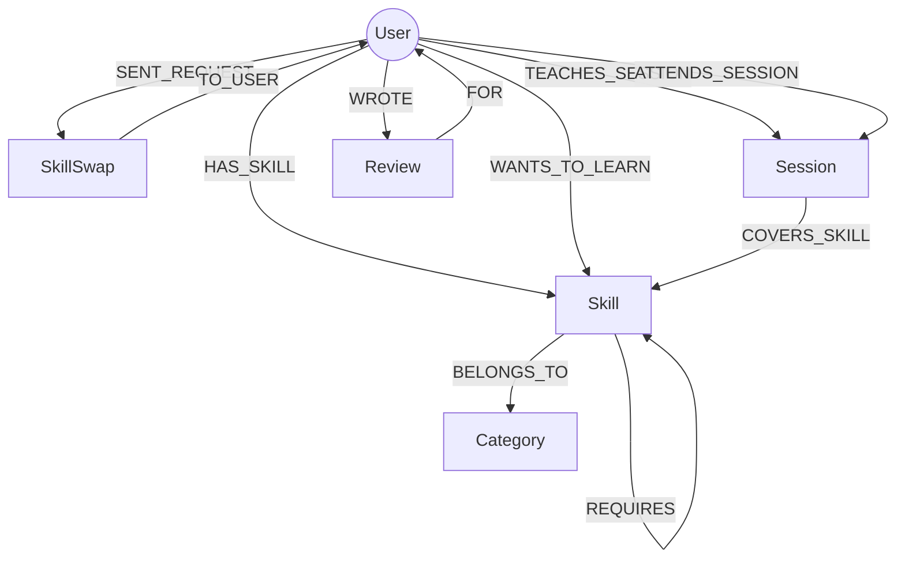

# 🔄 SkillSwap – Graph-Based Skill Exchange & Learning Platform

> **"Learn a skill. Share a skill. Grow together."**  
> *A full-stack, graph-powered peer learning network backed by **CognoDB** and **openCypher**.*

[](https://console.cognodb.com)
[](https://neo4j.com/docs/bolt/current/bolt/)
[](https://www.npmjs.com/package/neo4j-driver)
[](https://vitejs.dev/)
[](https://tailwindcss.com/)

---

## 1. Project Overview

**SkillSwap** is a full-stack, graph-native web application designed to connect learners and mentors through **reciprocal skill exchanges**.

In traditional learning platforms, finding an individual who knows what you want to learn *and* simultaneously wants to learn what you can teach is nearly impossible through standard table filters. **SkillSwap models users, skills, categories, prerequisites, and learning goals as an interconnected knowledge and social graph in CognoDB**.

### The Core Exchange Scenario:
```
       Kavya Nair                              Rahul Sharma
   ┌─────────────────┐                     ┌──────────────────┐
   │ Can Teach:      │                     │ Can Teach:       │
   │  • Angular      │──────HAS_SKILL─────>│  • Python        │
   │  • HTML / CSS   │                     │  • FastAPI / ML  │
   │                 │                     │                  │
   │ Wants to Learn: │<──WANTS_TO_LEARN────│ Wants to Learn:  │
   │  • Python       │                     │  • Angular       │
   │  • Node.js      │                     │  • TypeScript    │
   └─────────────────┘                     └──────────────────┘
            │                                       │
            └────────── 🎯 95% Skill Match ─────────┘
```

---

## 2. Why a Graph Database? (Graph vs. Relational SQL)

The fundamental question in SkillSwap is **"Who has complementary skills to mine?"**. This requires evaluating cyclical, bidirectional relationships and multi-hop paths across variable depths.

### The Relational (SQL) Bottleneck
In a standard relational SQL database (e.g., PostgreSQL, MySQL), finding a 2-way skill swap requires joining across **at least 4 to 6 junction tables** with multiple self-joins:

```sql
-- Relational SQL: Fragile, computationally expensive, degrades with scale
SELECT u.name, u.experience_level, u.rating,
       s1.name AS they_teach, s2.name AS you_teach
FROM users u
JOIN user_skills_taught ust ON ust.user_id = u.id
JOIN user_skills_wanted usw_me ON usw_me.skill_id = ust.skill_id AND usw_me.user_id = 'usr-kavya'
JOIN user_skills_wanted usw ON usw.user_id = u.id
JOIN user_skills_taught ust_me ON ust_me.skill_id = usw.skill_id AND ust_me.user_id = 'usr-kavya'
JOIN skills s1 ON s1.id = ust.skill_id
JOIN skills s2 ON s2.id = usw.skill_id
WHERE u.id <> 'usr-kavya';
```
- **Join Explosion**: As the user base and skill catalog grow, table scans and B-Tree index lookups create severe latency bottlenecks.
- **Recursive CTE Complexity**: Discovering indirect learning paths (e.g., *I want Machine Learning → Related to Python → Taught by Rahul*) requires complex recursive Common Table Expressions with manual cycle prevention.

### The CognoDB Graph Advantage
- **Index-Free Adjacency**: In CognoDB, relationships are stored as direct physical memory pointers. Traversing from a User to a Skill is an **$O(1)$ constant-time pointer dereference**.
- **Declarative Graph Patterns**: The exact same two-way match is expressed cleanly in **openCypher**:

```cypher
MATCH (me:User {userId: $userId})-[w:WANTS_TO_LEARN]->(wanted:Skill)<-[th:HAS_SKILL]-(partner:User)
MATCH (partner)-[pw:WANTS_TO_LEARN]->(offered:Skill)<-[mh:HAS_SKILL]-(me)
WHERE me <> partner
RETURN partner.name AS partnerName,
       collect(DISTINCT wanted.name) AS skillsTheyTeach,
       collect(DISTINCT offered.name) AS skillsYouTeach;
```

---

## 3. Graph Data Model

### Node Labels
| Node Label | Properties | Description |
| :--- | :--- | :--- |
| `(:User)` | `userId`, `name`, `email`, `bio`, `experienceLevel`, `location`, `rating`, `avatar` | Community members (learners & mentors) |
| `(:Skill)` | `skillId`, `name`, `category`, `icon`, `level`, `description` | Knowledge topics and technologies |
| `(:Category)` | `categoryId`, `name`, `icon` | Skill domain classification |
| `(:Session)` | `sessionId`, `date`, `time`, `mode`, `meetingLink`, `status` | Scheduled & completed 1-on-1 learning sessions |
| `(:SkillSwap)`| `swapId`, `status`, `message`, `createdAt` | Skill-exchange proposals |
| `(:Review)` | `reviewId`, `rating`, `comment`, `createdAt` | Peer testimonials and endorsements |

### Typed Relationships
| Relationship Type | Source Node | Target Node | Properties |
| :--- | :--- | :--- | :--- |
| `[:HAS_SKILL]` | `(:User)` | `(:Skill)` | `proficiency`, `experienceYears` |
| `[:WANTS_TO_LEARN]` | `(:User)` | `(:Skill)` | `priority`, `currentLevel` |
| `[:BELONGS_TO]` | `(:Skill)` | `(:Category)` | — |
| `[:RELATED_TO]` | `(:Skill)` | `(:Skill)` | — |
| `[:REQUIRES]` | `(:Skill)` | `(:Skill)` | `importance` |
| `[:SENT_REQUEST]` | `(:User)` | `(:SkillSwap)` | — |
| `[:TO_USER]` | `(:SkillSwap)` | `(:User)` | — |
| `[:TEACHES_SESSION]` | `(:User)` | `(:Session)` | — |
| `[:ATTENDS_SESSION]` | `(:User)` | `(:Session)` | — |
| `[:COVERS_SKILL]` | `(:Session)` | `(:Skill)` | — |
| `[:WROTE]` | `(:User)` | `(:Review)` | — |
| `[:FOR]` | `(:Review)` | `(:User)` | — |

### Mermaid Graph Schema Diagram


---

## 4. Key openCypher Queries

### Query 1: Direct 2-Way Skill Swap Match (⭐ Main Graph Query)
Finds complementary learning partners who can teach what the active user wants and want what the active user offers.
```cypher
MATCH (me:User {userId: $userId})-[w:WANTS_TO_LEARN]->(wanted:Skill)<-[th:HAS_SKILL]-(partner:User)
MATCH (partner)-[pw:WANTS_TO_LEARN]->(offered:Skill)<-[mh:HAS_SKILL]-(me)
WHERE me <> partner
RETURN partner.userId AS partnerId,
       partner.name AS partnerName,
       partner.experienceLevel AS partnerExperience,
       partner.rating AS partnerRating,
       partner.avatar AS partnerAvatar,
       collect(DISTINCT wanted.name) AS skillsTheyTeach,
       collect(DISTINCT offered.name) AS skillsYouTeach;
```

### Query 2: Multi-Hop Related Skill Recommendations (2+ Hops)
Traverses 2 hops: `User` → `WANTS_TO_LEARN` → `TargetSkill` → `RELATED_TO` → `RelatedSkill` ← `HAS_SKILL` ← `RecommendedTeacher`.
```cypher
MATCH (me:User {userId: $userId})-[:WANTS_TO_LEARN]->(targetSkill:Skill)-[:RELATED_TO*1..2]-(relatedSkill:Skill)<-[th:HAS_SKILL]-(partner:User)
WHERE me <> partner 
  AND NOT (me)-[:WANTS_TO_LEARN]->(relatedSkill)
  AND NOT (me)-[:HAS_SKILL]->(relatedSkill)
RETURN partner.name AS recommendedTeacher,
       targetSkill.name AS yourGoal,
       relatedSkill.name AS relatedSkillTaught,
       th.proficiency AS proficiency,
       th.experienceYears AS experienceYears;
```

### Query 3: Variable-Depth Prerequisite Learning Chain
Discovers foundational prerequisites needed for advanced technologies (e.g., Angular → TypeScript → JavaScript).
```cypher
MATCH path = (s:Skill {name: $skillName})-[:REQUIRES*1..4]->(prereq:Skill)
RETURN s.name AS targetSkill,
       [node IN nodes(path) | node.name] AS learningSequence,
       length(path) AS prerequisiteDepth,
       prereq.name AS foundationSkill;
```

### Query 4: Shortest Connection Path Between Any 2 Community Nodes
```cypher
MATCH (u1:User {name: $name1}), (u2:User {name: $name2}),
      p = shortestPath((u1)-[*]-(u2))
RETURN [node IN nodes(p) | node.name] AS connectionPath,
       length(p) AS hopCount;
```

---

## 5. System Architecture

```
                        ┌─────────────────────────────────┐
                        │         React Frontend          │
                        │    Vite + Tailwind CSS (SPA)    │
                        │        Hosted on Vercel         │
                        └────────────────┬────────────────┘
                                         │
                                   REST API (JSON)
                                         │
                        ┌────────────────┴────────────────┐
                        │      Node.js Express Server     │
                        │  Controllers, Routes, Fallback  │
                        │        Hosted on Render         │
                        └────────────────┬────────────────┘
                                         │
                                Bolt Protocol 5.0+
                             Official neo4j-driver
                                         │
                        ┌────────────────┴────────────────┐
                        │          CognoDB Cloud          │
                        │     Managed Graph Database      │
                        │    (console.cognodb.com c0)     │
                        └─────────────────────────────────┘
```

---

## 6. Project Structure

```
skillswap/
├── backend/
│   ├── config/
│   │   └── database.js               # CognoDB driver setup with connection check & fallback
│   ├── controllers/
│   │   ├── userController.js         # User profiles, skills taught & wanted
│   │   ├── skillController.js        # Skill directory, categories & prerequisites
│   │   ├── matchController.js        # 2-way matching & multi-hop recommendations
│   │   ├── swapController.js         # Swap request lifecycle (send, accept, reject)
│   │   ├── sessionController.js      # Learning session scheduling & review submissions
│   │   └── graphController.js        # Full graph export, pathfinding & DB health
│   ├── routes/
│   │   ├── userRoutes.js
│   │   ├── skillRoutes.js
│   │   ├── matchRoutes.js
│   │   ├── swapRoutes.js
│   │   ├── sessionRoutes.js
│   │   └── graphRoutes.js
│   ├── services/
│   │   └── graphService.js           # openCypher execution & in-memory graph engine
│   ├── queries/
│   │   ├── users.cypher
│   │   ├── skills.cypher
│   │   ├── matches.cypher
│   │   └── recommendations.cypher
│   ├── seed/
│   │   ├── seedData.js               # Rich realistic dataset
│   │   └── seed.js                   # CognoDB seeding script with parameterised Cypher
│   ├── middleware/
│   │   └── errorHandler.js           # Centralized error handling
│   ├── server.js                     # Express server entry point
│   ├── .env.example
│   └── package.json
│
├── frontend/
│   ├── src/
│   │   ├── components/
│   │   │   ├── Navbar.jsx            # User switcher, live DB status & Cypher modal trigger
│   │   │   ├── Sidebar.jsx           # Clean DevOps / Web platform navigation
│   │   │   ├── MatchCard.jsx         # 2-Way match card with 95% match score & details
│   │   │   ├── SkillBadge.jsx        # Category-tagged skill pill
│   │   │   ├── GraphCanvas.jsx       # Interactive Node-Link Canvas (zoom/pan/drag/filter)
│   │   │   ├── SendSwapModal.jsx     # Propose skill exchange modal
│   │   │   ├── ScheduleSessionModal.jsx # Schedule meeting modal
│   │   │   ├── CypherViewerModal.jsx # Live openCypher query inspector with SQL comparison
│   │   │   └── NodeDetailDrawer.jsx  # Slide-over inspector for graph nodes
│   │   ├── pages/
│   │   │   ├── Dashboard.jsx         # Key metrics, top matches & scheduled sessions
│   │   │   ├── MySkillsPage.jsx      # Skills I Can Teach vs Skills I Want to Learn
│   │   │   ├── FindSkillsPage.jsx    # Searchable skill catalog & teacher directory
│   │   │   ├── MatchesPage.jsx       # 2-Way match center & multi-hop recommendations
│   │   │   ├── RequestsPage.jsx      # Swap proposals (Accept/Reject/Schedule)
│   │   │   ├── SessionsPage.jsx      # Upcoming video sessions & star reviews
│   │   │   ├── ProfilePage.jsx       # User profile with bio, skills & testimonials
│   │   │   ├── GraphExplorerPage.jsx # Full-screen interactive graph canvas
│   │   │   └── CypherPlaygroundPage.jsx # openCypher query workbench
│   │   ├── services/
│   │   │   └── api.js                # Frontend REST client
│   │   ├── context/
│   │   │   └── AuthContext.jsx       # Active user state & user switching context
│   │   ├── index.css                 # Tailwind CSS styling & animations
│   │   ├── App.jsx                   # Main layout and tab routing
│   │   └── main.jsx
│   ├── index.html
│   ├── vite.config.js
│   ├── tailwind.config.js
│   ├── postcss.config.js
│   └── package.json
│
├── .env.example
├── .gitignore
└── README.md
```

---

## 7. CognoDB Cloud Setup Instructions

1. **Sign Up**: Go to [https://console.cognodb.com/signup](https://console.cognodb.com/signup) and create a free account (no credit card required).
2. **Create a Free (c0) Instance**: From the console, click **Create Instance** and select your preferred region. It provisions in under 60 seconds.
3. **Copy Connection Details**: Note your connection URI (format: `bolt+s://<instance-id>.databases.cognodb.cloud`) and generated password for the `cognodb` user.
4. **Configure Environment Variables**:
   Create a `.env` file inside `backend/` based on `backend/.env.example`:
   ```ini
   COGNODB_URI=bolt+s://<your-instance-id>.databases.cognodb.cloud
   COGNODB_USERNAME=cognodb
   COGNODB_PASSWORD=your-generated-password
   PORT=5000
   ```
5. **Run the Seed Script**:
   ```bash
   cd backend
   npm run seed
   ```

> [!NOTE]
> **Resilient Fallback Mode**: If you run SkillSwap without CognoDB Cloud credentials configured, the backend automatically activates a high-fidelity **In-Memory Graph Engine** matching the exact openCypher logic, so any reviewer can interact with the app immediately with zero configuration!

---

## 8. Installation & Running Locally

### Prerequisites
- Node.js 18+ and npm installed.

### Step 1: Install Dependencies
```bash
# In project root
npm run install:all
```

### Step 2: Start the Backend Server
```bash
cd backend
npm start
# Server starts on http://localhost:5000
```

### Step 3: Start the Frontend Development Server
```bash
cd frontend
npm run dev
# Vite dev server runs at http://localhost:3000
```

Open [http://localhost:3000](http://localhost:3000) in your browser!

---

## 9. Typical User Workflow & Demo Guide

For your **2–4 minute screen recording demo**:
1. **Explore the Dashboard**: Note the active persona (**Kavya Nair**), stats, and top 2-way match (**Rahul Sharma** with **95% Match**).
2. **Manage My Skills**:
   - Add **Angular** as a skill you can teach.
   - Add **Python** as a skill you want to learn.
3. **Discover 2-Way Matches**:
   - Open **2-Way Matches** tab.
   - See **Rahul Sharma**:
     - *Rahul teaches Python (Expert, 4y Exp)*
     - *Rahul wants to learn Angular (Beginner)*
     - *Match Score: 95%*
4. **Send a Skill Swap Proposal**:
   - Click **Propose Skill Swap**.
   - Review proposed exchange skills and submit.
5. **Accept & Schedule Learning Session**:
   - Switch user persona to **Rahul Sharma** via the top navbar switcher.
   - Go to **Swap Requests** → Click **Accept Swap**.
   - Click **Schedule Learning Session** → Set date/time and confirm.
   - Open **Learning Sessions** → Launch video room link.
6. **Open the Graph Explorer**:
   - Interact with the full-screen Canvas graph (zoom, pan, drag nodes).
   - Test the **Shortest Path** finder (e.g., `Kavya Nair` ➔ `Python`).
7. **Inspect openCypher Queries**:
   - Click **openCypher Workbench** in the top bar.
   - Review the direct 2-way Cypher match query and the Relational SQL comparison.

---

## 10. Deployment Plan

- **Frontend**: Deploy React application directly to **Vercel** with root directory set to `frontend`.
- **Backend**: Deploy Node.js Express server to **Render** with root directory set to `backend` and environment variables (`COGNODB_URI`, `COGNODB_USERNAME`, `COGNODB_PASSWORD`, `PORT=5000`).
- **Database**: Free tier **CognoDB Cloud** instance running on `bolt+s://`.

---


*Built with ❤️ for the Wexa AI Candidate Take-Home Assignment.*
